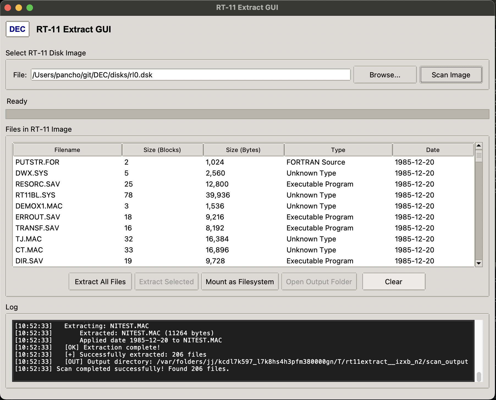
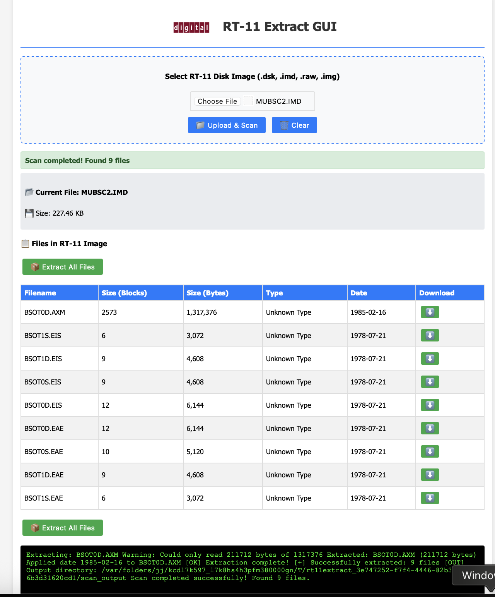

# RT-11 Extractor

Complete toolkit for extracting files from RT-11 disk images and converting ImageDisk (IMD) files with modern GUI and command-line interfaces.

## 🖥️ **What is RT-11?**

RT-11 was a real-time operating system developed by Digital Equipment Corporation (DEC) for the PDP-11 family of computers. This tool helps extract files from RT-11 disk images.

## 📦 **Project Components**

### Core Tools
- **`rt11extract`** - Command-line RT-11 extraction engine
- **`imd2raw.py`** - ImageDisk (IMD) to DSK/RAW converter
- **`rt11extract_gui.py`** - Desktop GUI application with IMD support and filesystem mounting
- **`rt11extract_simple.py`** - Web-based interface

### Filesystem Mounting
- **`rt11_fuse.sh`** - FUSE driver for macOS/Linux filesystem mounting
- **`rt11_mount.bat`** - WinFsp driver for Windows filesystem mounting
- **Standalone executables** - Platform-specific compiled drivers included in releases

## 🚀 **Quick Start**

### Option 1: Desktop GUI (Recommended)
```bash
python3 rt11extract_gui.py
```
*Supports both DSK and IMD files with automatic conversion*



### Option 2: Command Line Extraction
```bash
./rt11extract disk_image.dsk -l          # List files
./rt11extract disk_image.dsk -o output/  # Extract all files
```

### Option 3: IMD Conversion
```bash
./imd2raw input.imd output.dsk           # Convert ImageDisk to DSK
```

### Option 4: Web Interface
```bash
python3 rt11extract_simple.py
```
Then open http://localhost:8000 in your browser.



### Option 5: Filesystem Mounting (GUI)
1. **Open Desktop GUI**: `python3 rt11extract_gui.py`
2. **Select and scan** an RT-11 disk image
3. **Click "Mount as Filesystem"** button
4. **Browse files directly** in your file manager:
   - **Windows**: Mounted as drive letter (e.g., `X:`)
   - **macOS/Linux**: Mounted in `rt11_mounted/` folder
5. **Files appear as regular files** - copy, view, edit directly
6. **Click "Unmount Filesystem"** when done

*Requires FUSE (macOS/Linux) or WinFsp (Windows) - see System Requirements*

## 📱 **Download Pre-built Executables**

Pre-built executables are automatically generated for all platforms and available in the [Releases](../../releases) section.

### Available Platforms
- **Windows** (x86, x64, ARM64) - `.exe` files
- **macOS** (Intel x64, Apple Silicon ARM64) - Native executables
- **Linux** (x64) - Standalone executables

*Each release includes both GUI and command-line versions.*


## 🔧 **Features**

✅ **Complete RT-11 filesystem support**
✅ **ImageDisk (IMD) to DSK/RAW conversion**
✅ **Automatic IMD detection and conversion in GUI**
✅ **Multiple file extraction modes** (individual, batch)
✅ **Modern GUI with file format validation**
✅ **Web interface for remote access**
✅ **Cross-platform compatibility**
✅ **No external dependencies** (pure Python)
✅ **Original file dates preservation**
✅ **Error recovery and validation**

### 🗂️ **Filesystem Mounting**
✅ **Mount RT-11 images as local filesystem** (browse files directly in file manager)
✅ **FUSE support** for macOS and Linux
✅ **WinFsp support** for Windows
✅ **Automatic platform detection** (chooses FUSE or WinFsp automatically)
✅ **Smart mount management** (prevents conflicts, handles cleanup)
✅ **Integrated GUI controls** (mount/unmount with one click)
✅ **Drive letter assignment** (Windows - automatically finds available drive)
✅ **Graceful shutdown handling** (option to keep filesystem mounted on exit)

## 📋 **Supported Formats**

### Disk Image Formats
- **`.dsk`** - Standard RT-11 disk images
- **`.raw`** - Raw disk images
- **`.img`** - Generic disk images
- **`.imd`** - ImageDisk format (auto-converted)

### RT-11 File Types
- `.SAV` - Executable Programs
- `.DAT` - Data Files
- `.TXT` - Text Files
- `.BAS` - BASIC Programs
- `.FOR` - FORTRAN Source
- `.MAC` - MACRO Source
- `.OBJ` - Object Files
- And many more RT-11 file types

## 💻 **System Requirements**

### For Source Code
- **Python 3.6+** with Tkinter support
- **Any modern web browser** (for web interface)

### For Pre-built Executables
- **Windows 7+** (Windows executables)
- **macOS 10.14+** (macOS executables)
- **Linux** with glibc 2.17+ (Linux executables)

### For Filesystem Mounting (Optional)
- **macOS**: [macFUSE](https://osxfuse.github.io/) - Required for mounting RT-11 images as filesystems
- **Linux**: FUSE utilities - Install via package manager:
  - Ubuntu/Debian: `sudo apt install fuse libfuse-dev`
  - RHEL/CentOS: `sudo yum install fuse fuse-devel`
  - Arch Linux: `sudo pacman -S fuse2`
- **Windows**: [WinFsp](https://winfsp.dev/) - Required for mounting RT-11 images as drive letters
  - Download from: https://github.com/winfsp/winfsp/releases

## 🛠️ **Development and New Features**

All components are written in pure Python with no external dependencies beyond the standard library.

### New Features and Support:
- **Support for Unix V5, Unix V6, and RSX11 (File11 / ODS-1) variants**
  - Unix System V: Lists and extracts the complete directory tree.
- **Reference:** [FSX by kgober](https://github.com/kgober/FSX/blob/master/F)
- **In Development:** Support for PDP/8 (OS8) and Unix V7

### Development Setup

For GUI development with FUSE support, a Python virtual environment is recommended:

```bash
# Navigate to GUI directory
cd gui/desktop

# Create and activate virtual environment
python3 -m venv venv
source venv/bin/activate  # On Windows: venv\Scripts\activate

# Install required dependencies
pip install fusepy pillow

# Run the GUI
python rt11extract_gui.py
```

**Note**: The virtual environment is required for FUSE mounting functionality. If you encounter "fusepy not found" errors, ensure the virtual environment is activated and fusepy is installed.

#### FUSE Mounting Setup (macOS/Linux)

For filesystem mounting to work properly, ensure the required symbolic links are in place:

```bash
# Create symbolic links in filesystem_mount directory
cd backend/filesystem_mount
ln -sf ../extractors/rt11extract rt11extract
ln -sf ../extractors/rt11extract rt11extract_cli
ln -sf ../extractors/universal_extractor.py pdp11_smart_extractor.py
```

These links allow the FUSE driver to locate the extraction engines.

### Architecture
- **rt11extract** - Core extraction engine with RT-11 filesystem parser
- **imd2raw** - ImageDisk format converter (ported from C)
- **GUI application** - Tkinter-based desktop interface with IMD support
- **Web interface** - HTTP server with HTML5 interface

## 📚 **Technical References**

This project builds upon extensive research and documentation:

### Primary Sources
1. **[putr.asm by D-Bit](http://www.dbit.com/putr/putr.asm)** - Original ASM implementation that served as the foundation for this project's RT-11 filesystem parsing logic

2. **[RT-11 Technical Documentation from DEC](https://ia802804.us.archive.org/31/items/DIGITAL_Guide_to_RT-11_Documentation/DIGITAL_Guide_to_RT-11_Documentation.pdf)** - Official Digital Equipment Corporation guide to RT-11 documentation

3. **[RT-11 Volume and File Formats Manual](http://www.bitsavers.org/pdf/dec/pdp11/rt11/v5.6_Aug91/AA-PD6PA-TC_RT-11_Volume_and_File_Formats_Manual_Aug91.pdf)** - Comprehensive technical specification of RT-11 filesystem structures (v5.6, August 1991)

4. **[The Open SIMH Project](https://github.com/open-simh/simh)** - Historical computer simulation project

### Additional Resources
- **Bitsavers.org** - Digital preservation of computer documentation
- **Archive.org** - Historical computing documentation archive
- **PDP-11 Community** - Ongoing preservation and documentation efforts

## 📄 **License**

This project maintains the DEC heritage spirit - built for preservation and accessibility of historical computing systems.

## 🏛️ **About RT-11**

RT-11 was a real-time operating system developed by Digital Equipment Corporation (DEC) for the PDP-11 family of computers. This project helps preserve and access historical software by extracting files from RT-11 disk images.

---

Built with ❤️ for retro computing enthusiasts and digital preservation.
